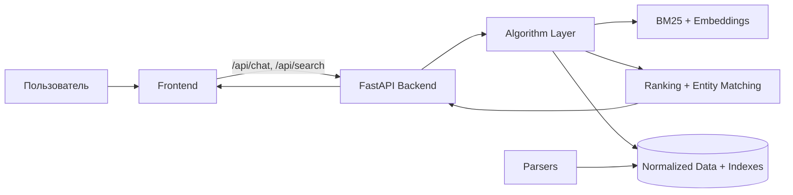

# CloudMatch

CloudMatch — MVP маркетплейса российских облачных сервисов. Пользователь описывает задачу обычным языком, система уточняет недостающие параметры, сопоставляет задачу с нормализованным каталогом провайдеров и возвращает top-3 провайдера или инфраструктурную связку.

## Проблема

Информация о российских облачных сервисах разбросана по сайтам провайдеров: тарифы, регионы, 152-ФЗ, API-документация, классы хранения и ограничения конфигураций находятся в разных разделах. Командам разработки приходится вручную сравнивать несколько провайдеров, чтобы подобрать сервис под задачу, бюджет, регион и регуляторные требования.

## Цель проекта

Создать прототип системы, которая сопоставляет пользовательскую задачу и облачные сервисы по контексту: стеку, бюджету, региону, 152-ФЗ и сценарию использования, а не только по ключевым словам.

## Что умеет CloudMatch

- понимает запросы на естественном языке;
- задаёт уточняющие вопросы;
- ищет top-3 провайдера для одиночного сервиса;
- собирает инфраструктурные связки;
- объясняет, почему сервис попал в выдачу;
- учитывает 152-ФЗ, регион, бюджет, стек и use case;
- показывает тарифные позиции с пояснением единиц тарификации.

## Ключевые достижения сверх ТЗ

1. **4 провайдера вместо минимальных 3**: Т1 Облако, Cloud.ru, Selectel, VK Cloud.
2. **Диалоговый агент** вместо простой формы фильтров.
3. **Связки сервисов**: Compute + Managed Database + Object Storage.
4. **Hybrid retrieval**: semantic embeddings + BM25.
5. **Многофакторное ранжирование**: регион, бюджет, 152-ФЗ, стек, компонент, use case.
6. **Production-ready схема**: FastAPI, Docker Compose, Nginx, healthcheck.
7. **Качество**: unit-тесты, golden dataset, метрики, LLM Judge.
8. **C4-документация** и подробный data flow.

## Сценарии

| Сценарий | Пример |
|---|---|
| Compute + 152-ФЗ | `Веб-приложение на Python, нужен 152-ФЗ, бюджет 30000 рублей в месяц, Москва.` |
| PostgreSQL | `DBaaS с PostgreSQL для тестовой среды, бюджет 10 тысяч рублей.` |
| Object Storage | `Хранилище для бэкапов, 500 ГБ, обязателен 152-ФЗ, любой регион РФ.` |
| Managed Kubernetes | `Кластер Kubernetes для продакшена, 152-ФЗ обязателен, регион Санкт-Петербург.` |
| Логи | `Сервис для сбора и анализа логов, ELK-совместимое решение, бюджет до 50000 рублей.` |
| Ближайший регион | `ВМ с 152-ФЗ во Владивостоке, до 10000 рублей.` |
| Связка | `Backend на Python, PostgreSQL и object storage на 500 ГБ, 152-ФЗ, Москва, бюджет до 200000.` |

## Архитектура кратко



Подробно: [`docs/ARCHITECTURE.md`](docs/ARCHITECTURE.md).

## Стек

| Слой | Технологии |
|---|---|
| Frontend | HTML, CSS, JavaScript |
| Backend | Python, FastAPI, Uvicorn |
| Algorithm | BM25, sentence-transformers, custom ranking |
| Data | JSON, normalized catalog |
| LLM | OpenAI-compatible client |
| Deployment | Docker Compose, Nginx |
| Testing | unittest, golden dataset, LLM Judge |

## Как работает агент

```text
User text
  -> DialogManager
  -> QueryExtractor
  -> QueryValidator
  -> hard filters
  -> HybridRetriever
  -> top-30 candidates
  -> pricing / budget / entity matching
  -> final scoring
  -> top provider selection или bundle builder
  -> explanation
  -> response formatter
```

LLM используется для понимания текста и объяснений. Финальное решение о ранжировании принимает код.

## Ранжирование

```text
retrieval_score = 0.7 * embedding_score + 0.3 * bm25_score
final_score = 0.7 * retrieval_score + 0.3 * entity_match_score
```

После retrieval берутся top-30 кандидатов. `entity_match_score` учитывает `component`, `tech_stack`, `use_case`, `budget`, `requirements`.

## Структура проекта

```text
.
├── backend/              # FastAPI API
├── frontend/             # static UI
├── algorithm/            # agent, retrieval, ranking, evaluation
├── parsers/              # provider parsers
├── data/                 # normalized JSON and golden dataset
├── docs/                 # project documentation
├── tests/                # unit tests
├── docker-compose.yml
└── README.md
```

## Быстрый запуск

```bash
python3 -m venv .venv
source .venv/bin/activate
pip install -r backend/requirements.txt
cp .env.example .env
python -m algorithm.scripts.build_indexes
uvicorn backend.app.main:app --reload --host 127.0.0.1 --port 8000
```

Frontend:

```bash
python3 -m http.server 5173 -d frontend
```

## Docker

```bash
docker compose up -d --build
curl -i http://127.0.0.1:8000/health
```

## API endpoints

| Метод | Endpoint | Назначение |
|---|---|---|
| GET | `/` | информация об API |
| GET | `/health` | healthcheck |
| POST | `/api/chat` | диалоговый агент |
| POST | `/api/search` | прямой поиск |
| GET | `/api/catalog` | каталог |
| GET | `/api/catalog/search` | поиск по каталогу |
| GET | `/api/catalog/services/{service_id}` | карточка сервиса |

## Тесты

```bash
python -m unittest
node --check frontend/app.js
```

## Обновление сервера

```bash
ssh -i ~/.ssh/cloud-marketplace-yc yc-user@51.250.18.102
cd /home/yc-user/t1_ml_school
git switch main
git pull origin main
sudo docker compose up -d --build
sudo rsync -a --delete frontend/ /var/www/cloud-marketplace/
sudo nginx -t
sudo systemctl reload nginx
```

## Документация

| Файл | Содержание |
|---|---|
| [`docs/ARCHITECTURE.md`](docs/ARCHITECTURE.md) | C4, компоненты, data flow |
| [`docs/DATA.md`](docs/DATA.md) | источники, схемы JSON, тарифы |
| [`docs/TESTING.md`](docs/TESTING.md) | тесты, метрики, golden dataset |
| [`docs/DEMO.md`](docs/DEMO.md) | сценарий защиты |
| [`docs/LIMITATIONS.md`](docs/LIMITATIONS.md) | ограничения MVP |
| [`docs/ROADMAP.md`](docs/ROADMAP.md) | план развития |
| [`docs/BEYOND_TZ.md`](docs/BEYOND_TZ.md) | достижения сверх ТЗ |
| [`backend/README.md`](backend/README.md) | backend/API |
| [`frontend/README.md`](frontend/README.md) | frontend/UI |
| [`algorithm/README.md`](algorithm/README.md) | pipeline/ranking |
| [`parsers/README.md`](parsers/README.md) | парсеры и импорт |
