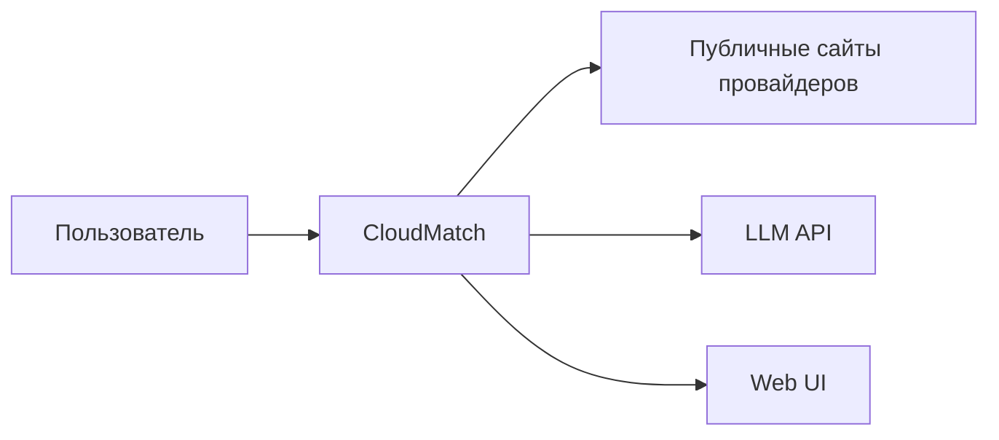
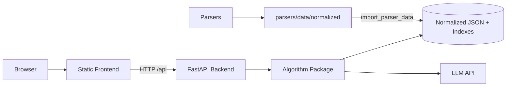
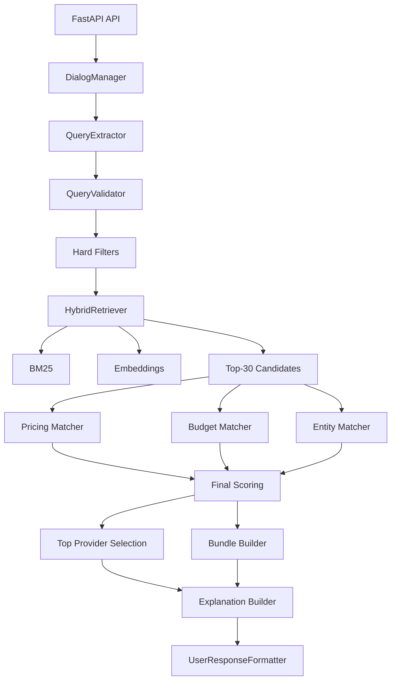

# Архитектура CloudMatch

## Назначение

CloudMatch состоит из frontend, backend, algorithm layer, parsers и normalized data. Архитектура разделяет UI, API, алгоритм подбора и сбор данных.

## C4 Level 1 — System Context



## C4 Level 2 — Containers



## C4 Level 3 — Components



## C4 Level 4 — Code / Modules

```mermaid
backend/app/
  main.py
  api/chat.py
  api/search.py

algorithm/cloudmatch/
  agent/
  retrieval/
  ranking/
  data/
  geo/
  evaluation/
  llm/
  schemas/

frontend/
  index.html
  styles.css
  app.js

parsers/
  cloud_ru_parser/
  selectel_parser/
  t1_cloud_parser/
  vk_cloud_parser/
  common/
```

## Data Flow

```text
1. Пользователь вводит запрос.
2. Frontend отправляет /api/chat или /api/search.
3. Backend вызывает SearchPipeline.
4. QueryExtractor извлекает структуру.
5. QueryValidator нормализует требования.
6. Hard filters применяют обязательные ограничения.
7. HybridRetriever считает BM25 + embeddings.
8. Выбираются top-30 кандидатов.
9. Ranking считает entity, budget и pricing scores.
10. Формируется top-3 или связка.
11. Explanation и formatter готовят ответ.
12. Frontend отображает результат.
```

## Роли компонентов

| Компонент | Роль |
|---|---|
| Frontend | UI, витрина, чат, карточки |
| Backend | HTTP API, связь UI и алгоритма |
| Algorithm | извлечение запроса, retrieval, ranking, explanation |
| Data | нормализованные JSON и индексы |
| Parsers | сбор публичных данных |
| Docker/Nginx | production-запуск и раздача frontend |

## Почему выбран такой стек

| Решение | Причина |
|---|---|
| FastAPI | быстрый API и OpenAPI из коробки |
| Static frontend | простой деплой без сборщика |
| JSON | достаточно для MVP и удобно для проверки |
| BM25 | точные совпадения по словам |
| Embeddings | смысловая близость |
| LLM на границах | понимание запроса и объяснение, но не финальное решение |
| Docker Compose | воспроизводимый backend |
| Nginx | production-раздача frontend и proxy API |
